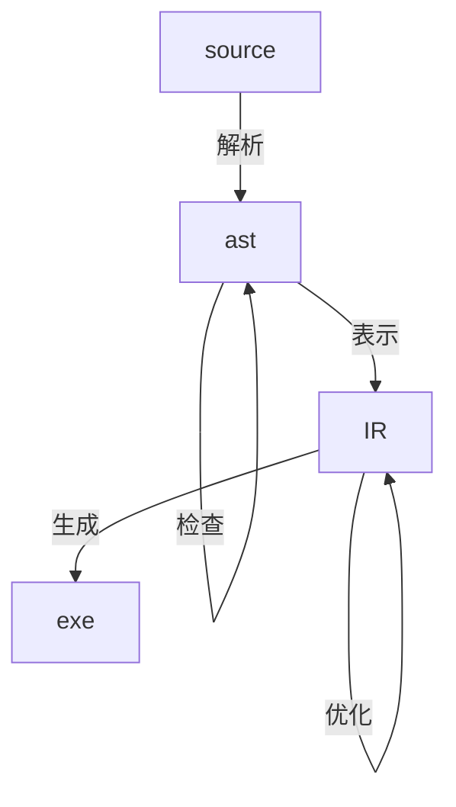

## meeting notes
### 20220323


#### 项目框架


- 解析
  flex
  bison
- 检查
  上下文名字检查
  类型检查
- 表示
  ADT的表示
  函数闭包
- 优化 暂时交给LLVM去做
  如尾递归转循环、循环展开、常数折叠
- 生成 交给LLVM

#### TODO
1. 安装LLVM，包括库环境的配置，能够通过Cpp接口实现一个Hello, World的样例
2. 使用LLVM编译一些小的例子，熟悉LLVM IR，能够将一些C语言的概念与LLVM IR中的概念对应上。
3. task3
4. 学习 doxygen

#### ADT
ADT 需要实现struct
#### 闭包的解糖
```javascript
let f = (x) => (y) => x+y
let tmp = f(3)

tmp(4)
tmp(5)
```

实际上类似于OOP
// tmp = { x = 3 } 匿名的struct
// with method operator()(int y){ return this->x+y }
OOP no virtual

obj.method
{
    // this ~> &obj
}

method(&obj, )

总之，上述两个特性都需要struct
#### 覆盖、屏蔽与生命周期

let x = 3;
let x = 1.2; // 覆盖了上一个x，可以不同类型
{
    putf x; // 使用{外的x
    var x = 3; // 屏蔽了{外的x
    let x = 3 + 2;
} // } 内的变量均释放
putf x // 1.2

生命周期参考C语言

#### 标准库
从测试样例来看，我们要支持字符、整数、浮点数的输出，最起码要支持字符的输入输出，才有IO手段，其他的输入输出可以通过字符输入输出进行模拟，相当于手动实现一个printf，回忆一下OS实验。
动态内存分配释放也是需要的。